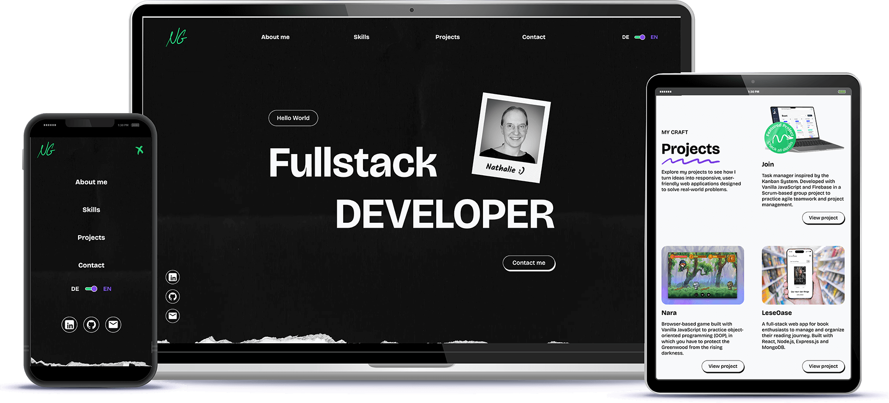

# PORTFOLIO

A personal portfolio website built with Angular, showcasing my projects, skills, and practical experience with modern web development tools.



# Highlights

- Dynamic project data using \*Angular Services
- Multilingual support implemented with ngx-translate
- Responsive design for desktop and mobile
- Modular, reusable component structure

# Technologies Used

- Angular 20
- TypeScript
- Angular Services & Routing
- ngx-translate
- RxJS

## Installation

This project was generated using [Angular CLI](https://github.com/angular/angular-cli) version 20.3.9.

1. clone the respository:

```
git clone <repo-url>
```

2. install the dependencies:

```
npm install
```

3. start the development server:

```
ng serve
```

4. open http://localhost:4200/

## Contact

For questions or feedback, please contact:

- Email: <contact@natgian.dev>
- GitHub: [natgian](https://github.com/natgian)
